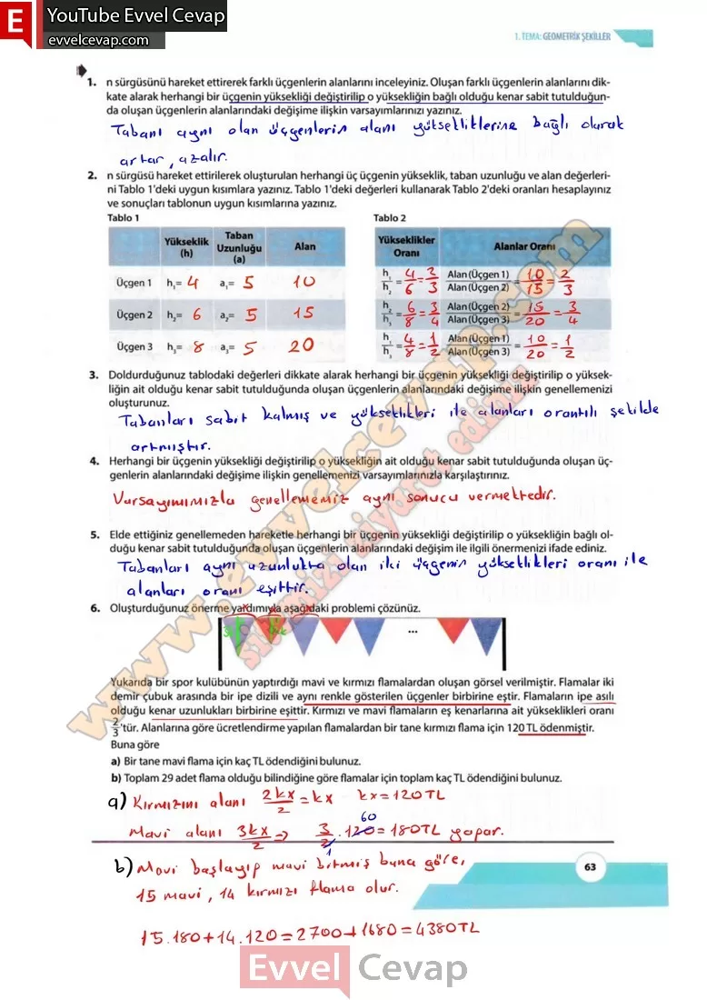

# 10. Sınıf Matematik Kitabı Cevapları Meb Yayınları Sayfa 63

---

**Soru: 1) n sürgüsünü hareket ettirerek farklı üçgenlerin alanlarını inceleyiniz. Oluşan farklı üçgenlerin alanlarını dikkate alarak herhangi bir üçgenin yüksekliği değiştirilip o yüksekliğin bağlı olduğu kenar sabit tutulduğunda oluşan üçgenlerin alanlarındaki değişime ilişkin varsayımlarınızı yazınız.**

**Soru: 2) n sürgüsü hareket ettirilerek oluşturulan herhangi üç üçgenin yükseklik, taban uzunluğu ve alan değerlerini Tablo 1 ‘deki uygun kısımlara yazınız.Tablo 1 ‘deki değerleri kullanarakTablo 2’deki oranları hesaplayınız ve sonuçları tablonun uygun kısımlarına yazınız.**

**Soru: 3) Doldurduğunuz tablodaki değerleri dikkate alarak herhangi bir üçgenin yüksekliği değiştirilip o yüksekliğin ait olduğu kenar sabit tutulduğunda oluşan üçgenlerin alanlarındaki değişime ilişkin genellemenizi oluşturunuz.**

**Soru: 4) Herhangi bir üçgenin yüksekliği değiştirilip o yüksekliğin ait olduğu kenar sabit tutulduğunda oluşan üçgenlerin alanlarındaki değişime ilişkin genellemenizi varsayımlarınızla karşılaştırınız.**

**Soru: 5) Elde ettiğiniz genellemeden hareketle herhangi bir üçgenin yüksekliği değiştirilip o yüksekliğin bağlı olduğu kenar sabit tutulduğunda oluşan üçgenlerin alanlarındaki değişim ile ilgili önermenizi ifade ediniz.**

**Soru: 6) Oluşturduğunuz önerme yardımıyla aşağıdaki problemi çözünüz. Yukarıda bir spor kulübünün yaptırdığı mavi ve kırmızı flamalardan oluşan görsel verilmiştir. Flamalar iki demir çubuk arasında bir ipe dizili ve aynı renkle gösterilen üçgenler birbirine eştir. Flamaların ipe asılı olduğu kenar uzunlukları birbirine eşittir. Kırmızı ve mavi flamaların eş kenarlarına ait yükseklikleri oranı 2/3’tür. Alanlarına göre ücretlendirme yapılan flamalardan bir tane kırmızı flama için 120 TL ödenmiştir. Buna göre**

**Soru: a) Bir tane mavi flama için kaç TL ödendiğini bulunuz.**

**Soru: b) Toplam 29 adet flama olduğu bilindiğine göre flamalar için toplam kaç TL ödendiğini bulunuz.**

-   **Cevap**:

