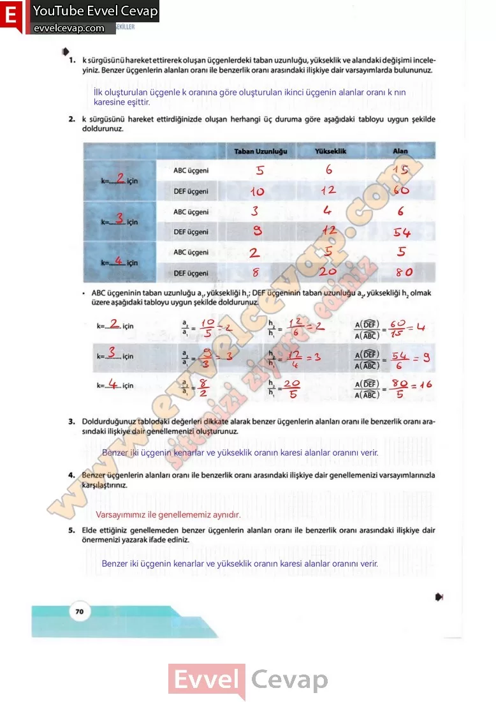

# 10. Sınıf Matematik Kitabı Cevapları Meb Yayınları Sayfa 70

---

**Soru: 1) k sürgüsünü hareket ettirerek oluşan üçgenlerdeki taban uzunluğu, yükseklik ve alandaki değişimi inceleyiniz. Benzer üçgenlerin alanları oranı ile benzerlik oram arasındaki ilişkiye dair varsayımlarda bulununuz.**

**Soru: 2) k sürgüsünü hareket ettirdiğinizde oluşan herhangi üç duruma göre aşağıdaki tabloyu uygun şekilde doldurunuz.**

**Soru: 3) Doldurduğunuz tablodaki değerleri dikkate alarak benzer üçgenlerin alanları oram ile benzerlik oranı arasındaki ilişkiye dair genellemenizi oluşturunuz.**

**Soru: 4) Benzer üçgenlerin alanları oranı ile benzerlik oram arasındaki ilişkiye dair genellemenizi varsayımlarınızla karşılaştırınız.**

**Soru: 5) Elde ettiğiniz genellemeden benzer üçgenlerin alanları oram ile benzerlik oranı arasındaki ilişkiye dair önermenizi yazarak ifade ediniz.**

-   **Cevap**:

