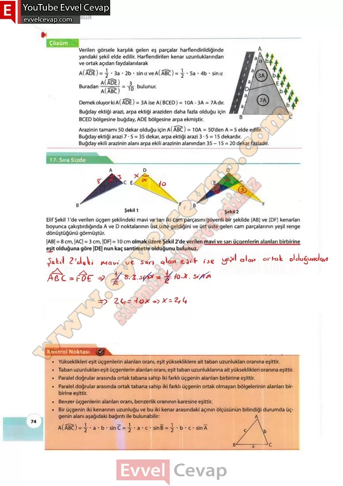

# 10. Sınıf Matematik Kitabı Cevapları Meb Yayınları Sayfa 74

---

**17. Sıra Sizde**

**Soru: Elif Şekil 1’de verilen üçgen şeklindeki mavi ve sarı iki cam parçasını güvenli bir şekilde [AB] ve [DF] kenarları boyunca çakıştırdığında A ve D noktalarının üst üste geldiğini ve üst üste gelen cam parçalarının yeşil renge dönüştüğünü görmüştür. |AB| = 8 cm, |AC| = 3 cm, |DF| = 10 cm olmak üzere Şekil 2’de verilen mavi ve sarı üçgenlerin alanları birbirine eşit olduğuna göre |DE| nun kaç santimetre olduğunu bulunuz.**

-   **Cevap**:

