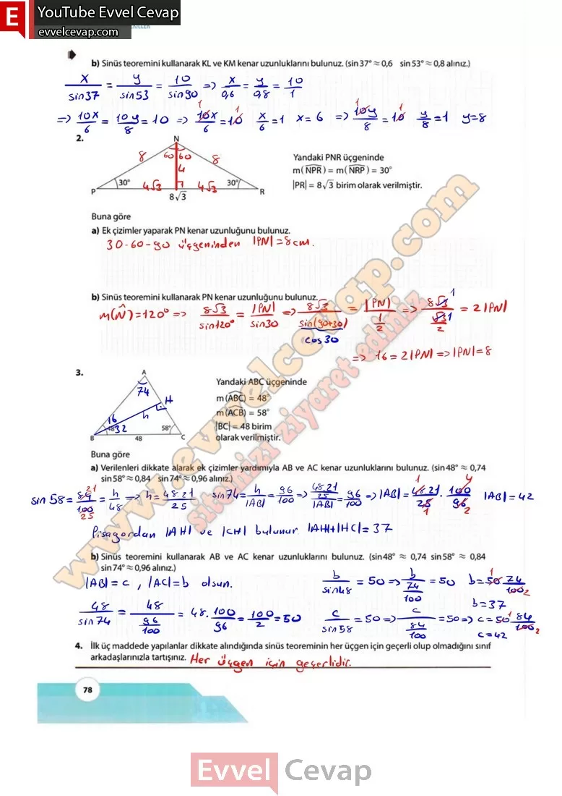

# 10. Sınıf Matematik Kitabı Cevapları Meb Yayınları Sayfa 78

---

**Soru: b) Sinüs teoremini kullanarak KL ve KM kenar uzunluklarını bulunuz, (sin 37° ~ 0,6 sin 53° ~ 0,8 alınız.)**

**Soru: 2) Yandaki PNR üçgeninde m( NPR) = m( NRP) = 30° |PR| = 8✓3 birim olarak verilmiştir. Buna göre**

**Soru: a) Ek çizimler yaparak PN kenar uzunluğunu bulunuz.**

**Soru: b) Sinüs teoremini kullanarak PN kenar uzunluğunu bulunuz.**

**Soru: 3) Yandaki ABC üçgeninde m (ABC) = 48° m(ACB) = 58° |BC| = 48 birim olarak verilmiştir. Buna göre**

**Soru: a) Verilenleri dikkate alarak ek çizimler yardımıyla AB ve AC kenar uzunluklarını bulunuz, (sin 48° ~ 0,74 sin 58° ~ 0,84 sin 74° 0,96 alınız.)**

**Soru: b) Sinüs teoremini kullanarak AB ve AC kenar uzunluklarını bulunuz. (sin48° ~ 0,74 sin58° ~ 0,84 sin 74° ~ 0,96 alınız.)**

**Soru: 4) İlk üç maddede yapılanlar dikkate alındığında sinüs teoreminin her üçgen için geçerli olup olmadığını sınıf arkadaşlarınızla tartışınız.**

-   **Cevap**:

