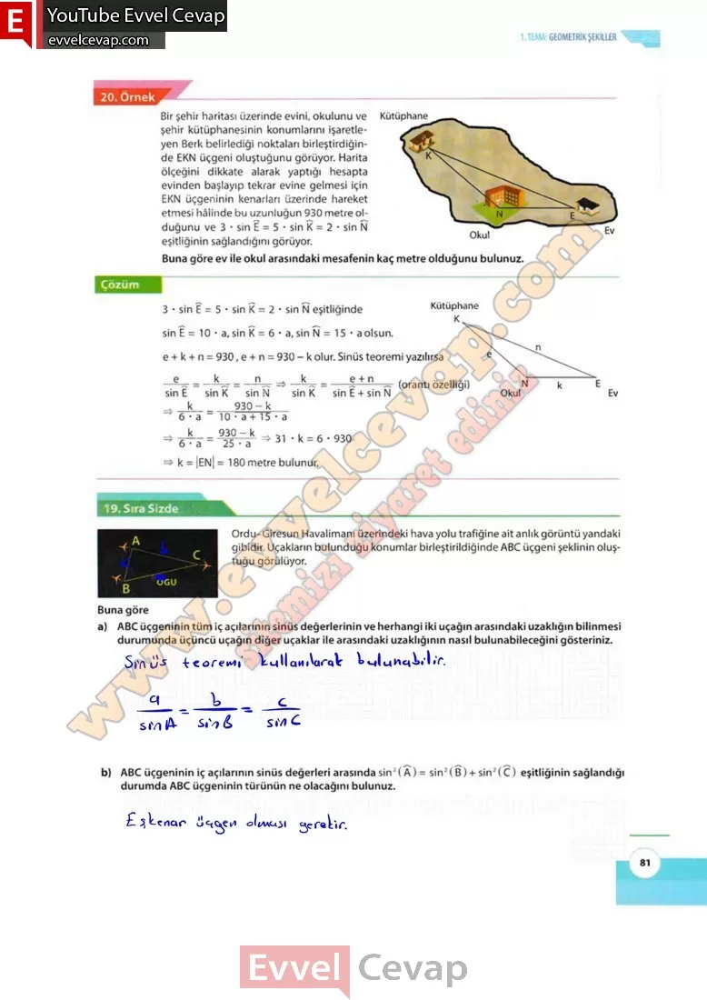

# 10. Sınıf Matematik Kitabı Cevapları Meb Yayınları Sayfa 81

---

Bir şehir haritası üzerinde evini, okulunu ve şehir kütüphanesinin konumlarını işaretleyen Berk belirlediği noktaları birleştirdiğinde EKN üçgeni oluştuğunu görüyor. Harita ölçeğini dikkate alarak yaptığı hesapta evinden başlayıp tekrar evine gelmesi için EKN üçgeninin kenarları üzerinde hareket etmesi hâlinde bu uzunluğun 930 metre olduğunu ve 3 • sin E = 5 • sin K = 2 • sin N eşitliğinin sağlandığını görüyor. Buna göre ev ile okul arasındaki mesafenin kaç metre olduğunu bulunuz.

**19. Sıra Sizde**

**Soru: Ordu-Giresun Havalimanı üzerindeki hava yolu trafiğine ait anlık görüntü yandaki gibidir. Uçakların bulunduğu konumlar birleştirildiğinde ABC üçgeni şeklinin oluştuğu görülüyor. Buna göre**

**Soru: a) ABC üçgeninin tüm iç açılarının sinüs değerlerinin ve herhangi iki uçağın arasındaki uzaklığın bilinmesi durumunda üçüncü uçağın diğer uçaklar ile arasındaki uzaklığının nasıl bulunabileceğini gösteriniz.**

**Soru: b) ABC üçgeninin iç açılarının sinüs değerleri arasında sin2(A) = sin 2(B) + sin2(C) eşitliğinin sağlandığı durumda ABC üçgeninin türünün ne olacağını bulunuz.**

-   **Cevap**:

