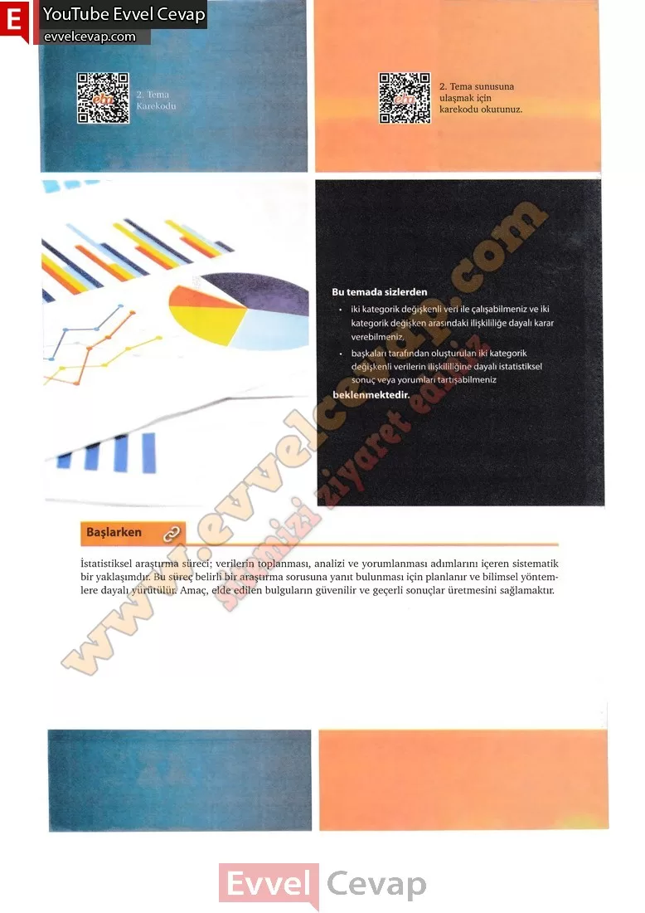

# 10. Sınıf Matematik Kitabı Cevapları Meb Yayınları Sayfa 95

---

İstatistiksel araştırma süreci; verilerin toplanması, analizi ve yorumlanması adımlarını içeren sistematik bir yaklaşımdır. Bu süreç belirli bir araştırma sorusuna yanıt bulunması için planlanır ve bilimsel yöntemlere dayalı yürütülür. Amaç, elde edilen bulguların güvenilir ve geçerli sonuçlar üretmesini sağlamaktır.

-   **Cevap**:**Bu sayfada soru bulunmamaktadır.**

